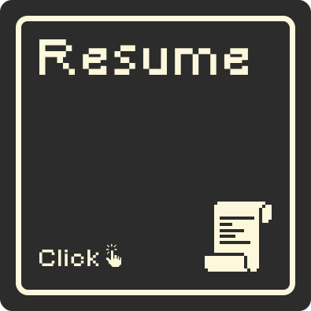

  

## Hi there, I'm Ali Shuaib 👋

I've enjoyed using web development to build solutions for real-world problems for over 5 years now. I started off building platformer games and discord bots in Python, and now I'm using Typescript with React/NextJS to build full stack applications. Thank god TypeScript exists, its saving lives 😆

I'm currently working on a LMS Assistant called [Orbite](https://gamejolt.com/games/SkyCrest/350478) to help improve online learning experience. I've also worked on [NGS Live Map](https://github.com/alishuaib/ngslivemap) to help the community of Phantasy Star Online 2: New Genesis collaboratively build a publicly accessible map.

These days I'm introducing highschool students how to code as a part-time online highschool teacher for ICS3U and ICS4U.

If you're interested in learning more about my full circle journey in development, check out the section below.

---

    
<h3>▼ My Development Journey in Short</h3>

I've been enjoying developing since highschool where I started off with a simple platformer called [Skycrest](https://gamejolt.com/games/SkyCrest/350478), built using [Construct 2](https://www.construct.net/en) a low-code game engine. I remember spending countless hours building game mechanics, creating pixel art and scratching my head figuring out what seemed like complex code for a junior with no coding background.

But the ability to create something from nothing and see it come to life is what got me passionate about programming.

From that point forward, I've began building project after project, learning new concepts and technologies along the way.

My first major project was building [Matoi-Chan](https://top.gg/bot/698556437508522015) for the game community of Phantasy Star Online 2, a discord bot written python which was jam packed with features such as web scraping, twitter feeds, image search, music player and much more.

I learned about best practices, version control, environments, cloud computing (AWS, GCP, Azure), databases, security; usually only after running into roadblocks if I'm being honest 😓.

When the bot was successful with over 1k discord communities, I decided to build a website to showcase its features, which led me to learn HTML, CSS and JS to build my first website.

I moved on to learning web development with React and NextJS after needing to build a complex live map [NGS Live Map](https://github.com/alishuaib/ngslivemap) for the same game community, that's when I discovered how I can use my passion for programming to help solve real-world problems and make a difference in people's lives.

After that point, I've been building websites and web applications for various clients and personal projects like my most recent one called [Orbite](https://gamejolt.com/games/SkyCrest/350478). I've also been learning about importance concepts like user experience, performance, testing and security.

These days I enjoy teaching and mentoring other "juniors" who are just starting out in programming as a part-time online highschool teacher. Really came full circle huh?

---

I'm currently on the lookout for a role as web developer, ideally working with JavaScript/Typescript or Python. I'd especially love to work with a team where I can make an impact to bring a difference in people's lives.

If you're hiring, lets chat!

